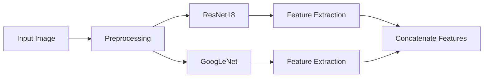
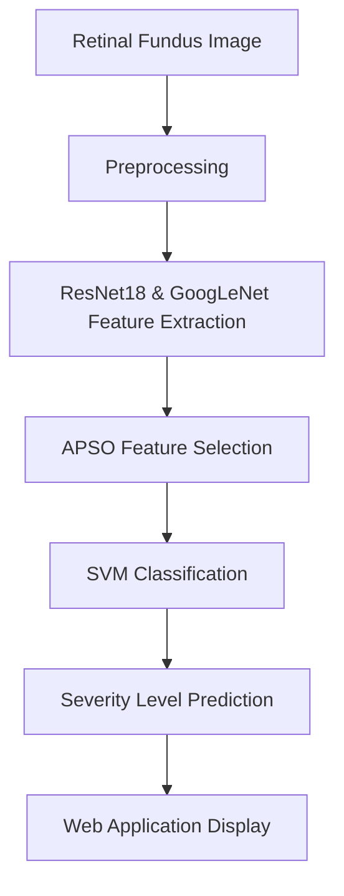

# Diabetic Retinopathy Detection Project 🩺👁️

[](https://www.python.org/)
[](https://pytorch.org/)
[](https://opencv.org/)
[](https://fastapi.tiangolo.com/)
[](https://react.dev/)

A web application for detecting and classifying Diabetic Retinopathy using Deep Learning (ResNet18, GoogLeNet) with APSO-based feature selection and SVM classification.

---

## 📋 Table of Contents

1. [Project Overview](#project-overview)
2. [Problem Statement](#problem-statement)
3. [Dataset](#dataset)
4. [Data Preprocessing](#data-preprocessing)
5. [Deep Learning Model Architecture](#deep-learning-model-architecture)
6. [Feature Selection](#feature-selection)
7. [Classification Model](#classification-model)
8. [Project Workflow](#project-workflow)
9. [Technologies Used](#technologies-used)
10. [Repository Structure](#repository-structure)
11. [Installation](#installation)
12. [Usage](#usage)
13. [Results](#results)
14. [Key Features](#key-features)
15. [Challenges Faced](#challenges-faced)
16. [Future Improvements](#future-improvements)
17. [References](#references)
18. [License](#license)
19. [Author](#author)

---

## 📖 Project Overview

### What is Diabetic Retinopathy?
Diabetic Retinopathy (DR) is a diabetes complication that affects eyes. It's caused by damage to the blood vessels of the light-sensitive tissue at the back of the eye (retina).

### Why Early Diagnosis is Important
- Early detection can prevent vision loss
- Enables timely treatment
- Improves patient outcomes
- Reduces healthcare costs

### Why AI and Deep Learning?
- Automated screening reduces workload on ophthalmologists
- Consistent and objective diagnosis
- Can be deployed in remote areas with limited access to specialists

### Objective of this Project
Develop an automated system to classify retinal fundus images into 5 severity levels of Diabetic Retinopathy with a user-friendly web interface.

---

## 🎯 Problem Statement
Develop an automated deep learning system capable of classifying retinal fundus images into different diabetic retinopathy severity levels to assist ophthalmologists in early diagnosis. The system should include a backend API for predictions and a frontend web application for user interaction.

---

## 📊 Dataset
- **Classes**: 5
- **Labels**:
  0. No DR
  1. Mild NPDR
  2. Moderate NPDR
  3. Severe NPDR
  4. PDR

---

## 🔄 Data Preprocessing
The preprocessing pipeline (implemented in [backend.py](file:///d:/Final%20Impl/backend.py#L223-L246)) includes:
1. Extract green channel from RGB image
2. Gaussian blur correction
3. Normalization
4. Top-hat transformation
5. CLAHE (Contrast Limited Adaptive Histogram Equalization)
6. Convert to 3-channel image
7. Resize to 224x224
8. Normalize using ImageNet stats

---

## 🤖 Deep Learning Model Architecture
This project uses two pre-trained models for feature extraction:

### 1. ResNet18
- Pre-trained on ImageNet
- Modified final layer for 5 classes
- Used for feature extraction

### 2. GoogLeNet (Inception v1)
- Pre-trained on ImageNet
- Auxiliary logits disabled
- Modified final layer for 5 classes
- Used for feature extraction

### Architecture Diagram


---

## 🔍 Feature Selection
This project uses **APSO (Adaptive Particle Swarm Optimization)** for feature selection:
- Reduces feature dimensionality
- Selects most relevant features
- Improves classification performance
- Implemented using pre-selected features from `apso_selected_features.npy`

---

## 🧠 Classification Model
The final classification is done using **Support Vector Machine (SVM)** with CalibratedClassifierCV from scikit-learn for probability estimates.

---

## 🔄 Project Workflow


---

## 🛠️ Technologies Used
| Technology | Version | Purpose |
|------------|---------|---------|
| Python | 3.10+ | Backend and ML |
| PyTorch | 2.0+ | Deep Learning |
| Torchvision | 0.23+ | Image processing & models |
| OpenCV | 4.0+ | Image preprocessing |
| NumPy | 1.26+ | Numerical operations |
| Scikit-learn | 1.5+ | SVM classification |
| FastAPI | 0.116+ | Backend API |
| Uvicorn | 0.35+ | ASGI server |
| React | 19.0+ | Frontend UI |
| Vite | 8.0+ | Frontend build tool |

---

## 📁 Repository Structure
```
Retinopathy-Diabetic-Project/
├── backend.py                  # FastAPI backend & ML logic
├── requirements.txt            # Python dependencies
├── .gitignore                  # Git ignore rules
├── retinascan-ui/
│   └── retinascan-ui/
│       ├── public/
│       │   ├── favicon.svg
│       │   ├── fundus-mock.png
│       │   └── icons.svg
│       ├── src/
│       │   ├── assets/
│       │   ├── pages/
│       │   │   ├── Dashboard.jsx
│       │   │   ├── Login.jsx
│       │   │   ├── PatientList.jsx
│       │   │   ├── PatientDetails.jsx
│       │   │   └── ReportView.jsx
│       │   ├── App.jsx
│       │   ├── index.css
│       │   └── main.jsx
│       ├── package.json
│       ├── vite.config.js
│       └── index.html
└── README.md                   # This file!
```

---

## 🛠️ Installation

### Backend Installation
1. Clone the repo:
   ```bash
   git clone https://github.com/Vishalraman-26/Retinopathy-Diabetic-Project.git
   cd Retinopathy-Diabetic-Project
   ```
2. Create virtual environment:
   ```bash
   python -m venv venv
   # Windows:
   venv\Scripts\activate
   # Linux/Mac:
   source venv/bin/activate
   ```
3. Install dependencies:
   ```bash
   pip install -r requirements.txt
   ```

### Frontend Installation
```bash
cd retinascan-ui/retinascan-ui
npm install
```

---

## 🚀 Usage

### Start Backend Server
```bash
python backend.py
```
Backend will be running at http://0.0.0.0:8000

### Start Frontend Server
```bash
cd retinascan-ui/retinascan-ui
npm run dev
```
Frontend will be running at http://localhost:5173

---

## ✨ Key Features
- 📷 Upload retinal fundus images
- 🏥 Classify into 5 severity levels
- 🔒 User authentication (Register/Login)
- 📊 Patient management system
- 📈 Detailed reports with confidence scores
- 📱 Responsive web interface
- 💾 Save patient and visit history

---

## 🚧 Challenges Faced
TODO: Add challenges faced during development

---

## 🔮 Future Improvements
- [ ] Add Grad-CAM for explainability
- [ ] Train on larger datasets
- [ ] Implement Vision Transformers (ViT)
- [ ] Add ensemble learning
- [ ] Hyperparameter tuning
- [ ] Real-time deployment
- [ ] Mobile application

---

## 📚 References
- PyTorch: https://pytorch.org/
- Torchvision: https://pytorch.org/vision/stable/
- FastAPI: https://fastapi.tiangolo.com/
- React: https://react.dev/
- Scikit-learn: https://scikit-learn.org/

---

## 📜 License
TODO: Add license

---

## 👨‍💻 Author
TODO: Add author details (GitHub, LinkedIn, Email)
