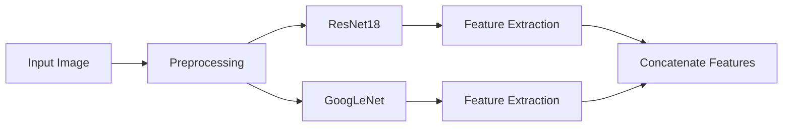
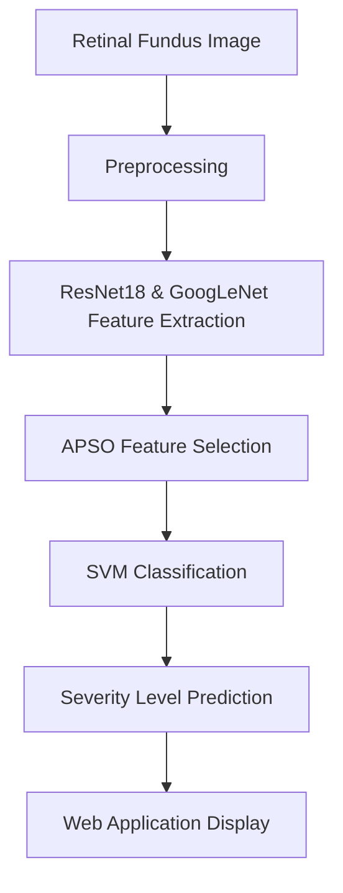

# Diabetic Retinopathy Detection Project 🩺👁️

[](https://www.python.org/)
[](https://pytorch.org/)
[](https://opencv.org/)
[](https://fastapi.tiangolo.com/)
[](https://react.dev/)

A web application for detecting and classifying Diabetic Retinopathy using Deep Learning (ResNet18, GoogLeNet) with APSO-based feature selection and SVM classification.

---

## 📋 Table of Contents

1. [Project Overview](#project-overview)
2. [Problem Statement](#problem-statement)
3. [Dataset](#dataset)
4. [Data Preprocessing](#data-preprocessing)
5. [Deep Learning Model Architecture](#deep-learning-model-architecture)
6. [Feature Selection](#feature-selection)
7. [Classification Model](#classification-model)
8. [Project Workflow](#project-workflow)
9. [Technologies Used](#technologies-used)
10. [Repository Structure](#repository-structure)
11. [Installation](#installation)
12. [Usage](#usage)
13. [Results](#results)
14. [Key Features](#key-features)
15. [Challenges Faced](#challenges-faced)
16. [Future Improvements](#future-improvements)
17. [References](#references)
18. [License](#license)
19. [Author](#author)

---

## 📖 Project Overview

### What is Diabetic Retinopathy?
Diabetic Retinopathy (DR) is a diabetes complication that affects eyes. It's caused by damage to the blood vessels of the light-sensitive tissue at the back of the eye (retina).

### Why Early Diagnosis is Important
- Early detection can prevent vision loss
- Enables timely treatment
- Improves patient outcomes
- Reduces healthcare costs

### Why AI and Deep Learning?
- Automated screening reduces workload on ophthalmologists
- Consistent and objective diagnosis
- Can be deployed in remote areas with limited access to specialists

### Objective of this Project
Develop an automated system to classify retinal fundus images into 5 severity levels of Diabetic Retinopathy with a user-friendly web interface.

---

## 🎯 Problem Statement
Develop an automated deep learning system capable of classifying retinal fundus images into different diabetic retinopathy severity levels to assist ophthalmologists in early diagnosis. The system should include a backend API for predictions and a frontend web application for user interaction.

---

## 📊 Dataset
- **Classes**: 5
- **Labels**:
  0. No DR
  1. Mild NPDR
  2. Moderate NPDR
  3. Severe NPDR
  4. PDR

---

## 🔄 Data Preprocessing
The preprocessing pipeline (implemented in includes:
1. Extract green channel from RGB image
2. Gaussian blur correction
3. Normalization
4. Top-hat transformation
5. CLAHE (Contrast Limited Adaptive Histogram Equalization)
6. Convert to 3-channel image
7. Resize to 224x224
8. Normalize using ImageNet stats

---

## 🤖 Deep Learning Model Architecture
This project uses two pre-trained models for feature extraction:

### 1. ResNet18
- Pre-trained on ImageNet
- Modified final layer for 5 classes
- Used for feature extraction

### 2. GoogLeNet (Inception v1)
- Pre-trained on ImageNet
- Auxiliary logits disabled
- Modified final layer for 5 classes
- Used for feature extraction

### Architecture Diagram


---

## 🔍 Feature Selection
This project uses **APSO (Adaptive Particle Swarm Optimization)** for feature selection:
- Reduces feature dimensionality
- Selects most relevant features
- Improves classification performance
- Implemented using pre-selected features from `apso_selected_features.npy`

---

## 🧠 Classification Model
The final classification is done using **Support Vector Machine (SVM)** with CalibratedClassifierCV from scikit-learn for probability estimates.

---

## 🔄 Project Workflow


---

## 🛠️ Technologies Used
| Technology | Version | Purpose |
|------------|---------|---------|
| Python | 3.10+ | Backend and ML |
| PyTorch | 2.0+ | Deep Learning |
| Torchvision | 0.23+ | Image processing & models |
| OpenCV | 4.0+ | Image preprocessing |
| NumPy | 1.26+ | Numerical operations |
| Scikit-learn | 1.5+ | SVM classification |
| FastAPI | 0.116+ | Backend API |
| Uvicorn | 0.35+ | ASGI server |
| React | 19.0+ | Frontend UI |
| Vite | 8.0+ | Frontend build tool |

---

## 📁 Repository Structure
```
Retinopathy-Diabetic-Project/
├── backend.py                  # FastAPI backend & ML logic
├── requirements.txt            # Python dependencies
├── .gitignore                  # Git ignore rules
├── retinascan-ui/
│   └── retinascan-ui/
│       ├── public/
│       │   ├── favicon.svg
│       │   ├── fundus-mock.png
│       │   └── icons.svg
│       ├── src/
│       │   ├── assets/
│       │   ├── pages/
│       │   │   ├── Dashboard.jsx
│       │   │   ├── Login.jsx
│       │   │   ├── PatientList.jsx
│       │   │   ├── PatientDetails.jsx
│       │   │   └── ReportView.jsx
│       │   ├── App.jsx
│       │   ├── index.css
│       │   └── main.jsx
│       ├── package.json
│       ├── vite.config.js
│       └── index.html
└── README.md               
```

---

# 📊 Results

The proposed diabetic retinopathy classification system was evaluated on the EyePACS dataset using transfer learning and an SVM classifier. The model achieved strong performance on the training and validation sets while maintaining good generalization on the unseen test set.

## 📈 Overall Performance

| Metric | Value |
|---------|-------|
| **Train Accuracy** | **96.48%** |
| **Validation Accuracy** | **92.88%** |
| **Test Accuracy** | **78.22%** |
| **Best SVM Parameters** | **C = 15, γ = 0.005** |

> The optimal hyperparameters were obtained through hyperparameter tuning, resulting in the best classification performance on the validation set.

---

## 📑 Validation Classification Report

| Class | Precision | Recall | F1-Score |
|-------|----------:|--------:|---------:|
| No DR | 0.82 | 0.91 | 0.86 |
| Mild | 0.92 | 0.85 | 0.89 |
| Moderate | 0.92 | 0.89 | 0.91 |
| Severe | 1.00 | 1.00 | 1.00 |
| Proliferative | 1.00 | 0.99 | 1.00 |

**Overall Validation Accuracy:** **92.88%**

### Validation Report

<p align="center">

</p>

---

## 📑 Test Classification Report

| Class | Precision | Recall | F1-Score |
|-------|----------:|--------:|---------:|
| No DR | 0.87 | 0.86 | 0.87 |
| Mild | 0.33 | 0.32 | 0.33 |
| Moderate | 0.57 | 0.68 | 0.62 |
| Severe | 0.97 | 0.49 | 0.66 |
| Proliferative | 0.94 | 0.64 | 0.76 |

**Overall Test Accuracy:** **78.22%**

### Test Report

<p align="center">

</p>

---

## 🔍 Confusion Matrix

The normalized confusion matrix illustrates the classification performance for each diabetic retinopathy severity level. Most **No DR** images were classified correctly, while confusion mainly occurred among the intermediate stages (**Mild** and **Moderate**), which exhibit similar retinal characteristics.

<p align="center">

</p>

---

## 💡 Key Observations

- ✅ Achieved **96.48%** training accuracy and **92.88%** validation accuracy.
- ✅ Final **test accuracy reached 78.22%** on unseen retinal images.
- ✅ Excellent classification performance for **No DR** and **Severe** stages.
- ⚠️ Most misclassifications occurred between **Mild** and **Moderate** classes due to subtle retinal abnormalities.
- ⚠️ Class imbalance in the EyePACS dataset affected the prediction performance of minority classes.

---

## 🛠️ Installation

### Backend Installation
1. Clone the repo:
   ```bash
   git clone https://github.com/Vishalraman-26/Retinopathy-Diabetic-Project.git
   cd Retinopathy-Diabetic-Project
   ```
2. Create virtual environment:
   ```bash
   python -m venv venv
   # Windows:
   venv\Scripts\activate
   # Linux/Mac:
   source venv/bin/activate
   ```
3. Install dependencies:
   ```bash
   pip install -r requirements.txt
   ```

### Frontend Installation
```bash
cd retinascan-ui/retinascan-ui
npm install
```

---

## 🚀 Usage

### Start Backend Server
```bash
python backend.py
```
Backend will be running at http://0.0.0.0:8000

### Start Frontend Server
```bash
cd retinascan-ui/retinascan-ui
npm run dev
```
Frontend will be running at http://localhost:5173

---

## ✨ Key Features
- 📷 Upload retinal fundus images
- 🏥 Classify into 5 severity levels
- 🔒 User authentication (Register/Login)
- 📊 Patient management system
- 📈 Detailed reports with confidence scores
- 📱 Responsive web interface
- 💾 Save patient and visit history

---

## 🚧 Challenges Faced

1. Class Imbalance

The EyePACS dataset was highly imbalanced, with the No DR class containing far more images than the severe diabetic retinopathy classes. This caused the model to become biased toward the majority class, making it difficult to accurately classify minority disease stages. To address this, techniques such as class weighting and data augmentation were explored.

2. Overfitting and Model Generalization

Despite using transfer learning, the model initially achieved better training performance than validation performance, indicating overfitting. Improving generalization required experimenting with preprocessing techniques, data augmentation, regularization, learning rate scheduling, and hyperparameter tuning to achieve more stable validation accuracy.

---

## Screenshots

### Login Page


### Doctor Dashboard


### Retinal Image Upload Page


### Diagnosis Page


### User History


### Generated Report


---

## 🔮 Future Improvements
- [ ] Add Grad-CAM for explainability
- [ ] Train on larger datasets
- [ ] Implement Vision Transformers (ViT)
- [ ] Add ensemble learning
- [ ] Hyperparameter tuning
- [ ] Real-time deployment
- [ ] Mobile application

---

## 📚 References
- PyTorch: https://pytorch.org/
- Torchvision: https://pytorch.org/vision/stable/
- FastAPI: https://fastapi.tiangolo.com/
- React: https://react.dev/
- Scikit-learn: https://scikit-learn.org/

---

## 👨‍💻 Author
Name       : Vishal Raman V

GitHub     : https://github.com/Vishalraman-26

Linked In  : https://www.linkedin.com/in/vishal-raman-v-762857300/
